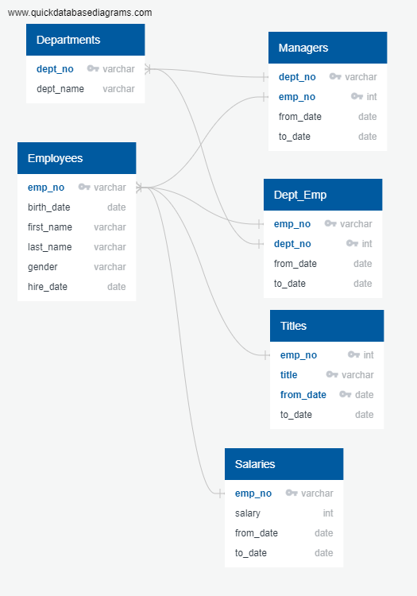

# Pewlett-Hackard-Analysis
Module 7: Employee Database with SQL

## Project Overview
We've been tasked by the HR department of Pewlett Hackard to get ready for the Silver Tsumani by reorganizing their databases - getting new tables/files of employees ready to retire by department/title/salary.

## Resources
- Postgres 11.5, PgAdmin 4, SQL
- departments.csv, dept_emp.csv, dept_manager.csv, employees.csv, salaries.csv, titles.csv

## Summary
We started by creating the ERD to get a better view of the different relationshiops between the tables.

Then, after importing all the files, creating databases into PgAdmin, and analysing them, we wrote SQL querries to create new tables containing the number of employees elegible for a retirement package. We produced the corresponding csv files:
- retirement_info.csv : all employyes retiring - emp_no, first name, last name
- retirement_dept_info: number of employees retiringg by department
- manager_info: managers retiring by department - dept_no, department, emp_no, first name, last name, from_date, to_date
- sales_retirement_info: employees retiring in Sales department: emp_no, first name, last name, department
- sales_development_retirement-info: employees retiring in Sales and development department: emp_no, first name, last name, department

As we did for these last 2 files, we can easily get the same information for each department, or any combination of departments.

Looking ate these new tables, we noticed a clear lack of salary raise, and that only 2 department managers out of 9 will be retiring soon. We could also find duplicates in the different tables because of title and deparetment changes over the employee's careers so having a new current table would be beneficial  - per instance, keeping the same titles table (renamed titles_history) but work with a current one showing only the titles of current employees with their current title.

## Challenge overview
Getting tables/files of employees ready to retire grouped by job title, and of employees eligible for the mentorship program.

## Challenge Summary

- Table 1: employees ready to retire grouped by title

Looking at the ERD, we see that the employee number, first and last name can be founnd in the table Employees, salary in the table Salaries, and title and from_date in the table Titles. But we have already created a new table, emp_info, with all the employees ready to retire, with their number, name and salary. So we only need to join it with the table Title. 

Because of the from_date/to_date keys in the table Titles, we can be assured that we won't have any duplicates (we've already chosen the retirees with the to_date = '9999-01-01' in emp_info). 

So we can create this table with only 1 join, and no partitionning:
         
         SELECT ei.emp_no, ei.first_name, ei.last_name, t.title, t.from_date, ei.salary
         INTO retirement_by_title
         FROM emp_info ei
         JOIN titles t ON (ei.emp_no = t.emp_no AND ei.to_date = t.to_date)
         ORDER BY t.title, ei.emp_no
     
 We also tried another method, by, at first, simply joining emp_info and Titles, without filtering by to_date. This tyable would then have several duplicates because of the title changes employyes may have been through. To get rid of the duplictaes, we partitionned this table by only keeping the most recent title.
 
        SELECT ei.emp_no, ei.first_name, ei.last_name, t.title, t.from_date, ei.salary
        INTO retirement_title_dup
        FROM emp_info ei
        JOIN titles t ON ei.emp_no = t.emp_no 
        ORDER BY t.title, ei.emp_no; 
        
        SELECT tmp.emp_no, tmp.first_name, tmp.last_name, tmp.title, tmp.from_date, tmp.salary
        INTO retirement_title_part
        FROM
            (SELECT rtd.emp_no, rtd.first_name, rtd.last_name, rtd.title, 
             rtd.from_date, rtd.salary, ROW_NUMBER() OVER
              (PARTITION BY (emp_no)
              ORDER BY from_date DESC) rn
              FROM retirement_title_dup rtd
               ) tmp WHERE rn = 1
          ORDER BY emp_no;
          
We checked that both tables gave the same result.
            
            SELECT * FROM retirement_by_title
            EXCEPT
            SELECT * FROM retirement_title_part;

The info is all in the file reirement_by_title.csv, where we see that 33,118 employees will retire. As they are all ordered by title, we can easily group them by title and give the number of employees per each title with this query:

          SELECT title, COUNT(1)
          FROM retirement_by_title
          GROUP BY title;
          
There will be 2711 Engineers, 13651 Senior Engineers,2 Managers, 251 Assistant Engineers, 2022 Staff, 12872 Senior Staff, and 1609 Technique Leaders retiring.

- Table 2: employees ready to enter the mentorship program.

To be eligible to enter the mentorship program, employees must have been born in 1965.

The ERD shows that the table Employees gives us the birth date of every employees, and that the table Titles gives us the from-date and to_date. As we used for the Table 1, we can easily get the table of future mentors by joining these 2 tables.

            SELECT e.emp_no, e.first_name, e.last_name, t.title, t.from_date, t.to_date
            INTO mentorship_eligibility
            FROM employees e
            JOIN titles t
            ON e.emp_no = t.emp_no
            WHERE (e.birth_date BETWEEN '1965-01-01' AND '1965-12-31')
	          AND t.to_date = ('9999-01-01')
            
We could also have used the from_date seen in the Dept_emp to get the date when they entered the department in which they mentor with their latest title, which needs 2 JOIN (Employees - Dept_emp - Titles).

          SELECT e.emp_no, e.first_name, e.last_name, t.title, de.from_date, de.to_date
          INTO mentorship_el_2
          FROM employees e
          JOIN titles t
          ON e.emp_no = t.emp_no
          JOIN dept_emp as de
           ON t.emp_no = de.emp_no
          WHERE (e.birth_date BETWEEN '1965-01-01' AND '1965-12-31')
	          AND t.to_date = ('9999-01-01')

We checked that both tables give us the same result.

          SELECT me.emp_no FROM mentorship_eligibility me
          EXCEPT
          SELECT ml.emp_no FROM mentorship_el_2 ml;
          
There are 1,549 employees who could be eligible to enter the mentorship program.

Doing a similar query group by title as for Table 1, we see that there are 29 Assistant Engineers, 569 Senior Staff, 77 Technique Leaders, 190 Engineers, and 529 Senior Engineers.

To differentiate them and see who would have most experience, we can have 3 from_date dates in this table, the date when they were hired (in the table Employees), and the date when they entered their current Department (in the table Dept_emp), and the date when they started their current title.

